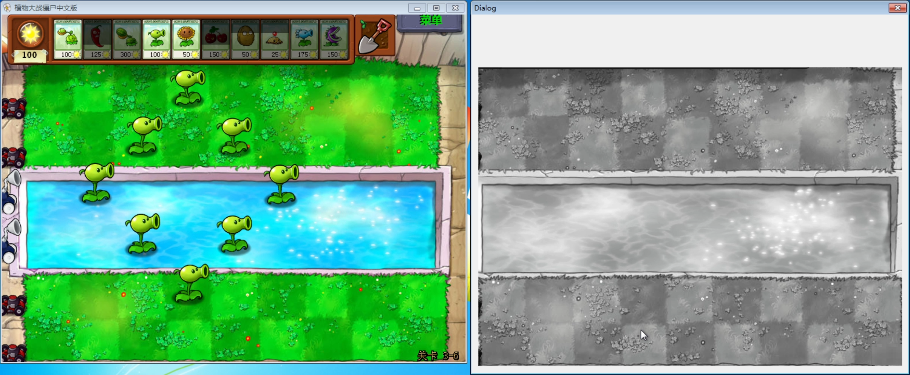

# Game Assistance Plants vs Zombies

A tool to plant Peashooter anywhere without cold-down.

For study purpose only.

Video Demo: [Vimeo](https://vimeo.com/434653404)

Executable File Download: [Google Drive](https://drive.google.com/drive/folders/1kosHNwibYfFa_6pvcXbufKA8rBibAdtK?usp=sharing)

Steps (CreateRemoteThread dll injection):
- Using CheatEngine, located the memory address of Sun
- Using OllyDbg, intercepted the memory address of the planting function, since it causes the decrease of Sun
- Allocated heap memory in PvZ process, and wrote the assistance dll's path into the heap
- Created remote thread in PvZ process, which would load the assistance dll
- The assistance dll would listen to KEYDOWN event of DEL, which would trigger the assistance window's appearance
- When user clicked in the assistance window, called the previously intercepted planting function's address, with arbitrary parameters (plant type and position)

---

# 植物大战僵尸辅助工具

一个能无限制种植豌豆射手的辅助工具。

仅供学习使用。

演示视频：[BiliBili](https://www.bilibili.com/video/BV1DK4y147Po/)

可执行文件下载：[蓝奏云](https://wws.lanzous.com/itzeee8tnnc)

步骤（创建远程线程 dll注入）：
- 使用CheatEngine，定位阳光的内存地址
- 由于种植植物会减少阳光，使用OllyDbg，拦截到种植植物函数
- 在游戏进程中申请一块堆空间，并把辅助工具dll的路径写入此空间
- 在游戏进程中创建远程线程，此线程会加载辅助工具dll
- 辅助工具dll会监听DEL键的按下事件，触发此事件会让辅助工具的窗口跳出
- 当用户在辅助工具的窗口点击鼠标，线程会调用之前拦截到的种植植物函数的地址，并使用特定的函数参数（自定植物的类型和坐标）